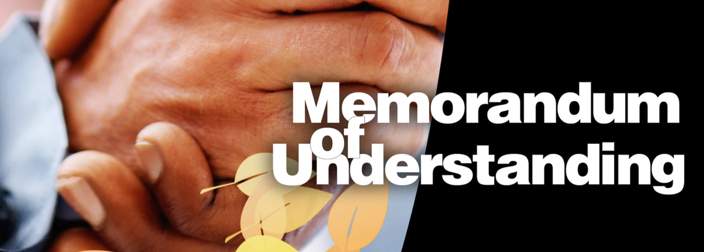
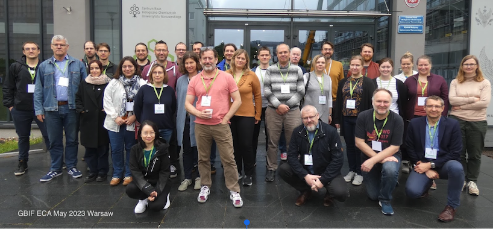
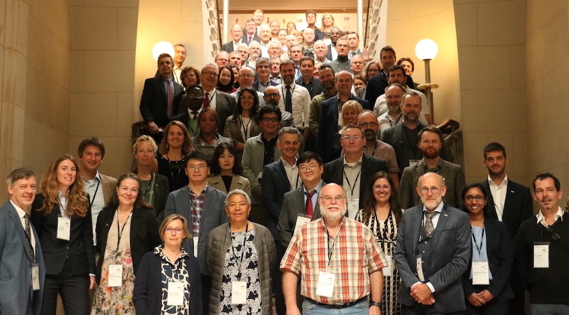

# 1: [GBIF participation](https://docs.google.com/presentation/d/1LpvVyCKgghbAvn8yIMoCCYEr7E2nF0-53eSBjr-ckV4/edit?usp=sharing)

> ## Exercise 1: Investigate Croatia participation in GBIF
> 
> Find out information on Croatia on GBIF.org
> In which regional network is Croatia?
> Explore [Croatia Country page](https://www.gbif.org/country/HR/summary)

# 2: [The Nodes](https://docs.google.com/presentation/d/1w-JcMmh6PTuum81Qr0q3SeHBgy7yF0FjjbVX_9bSgH0/edit?usp=sharing)

> ## Exercise 2: Investigate the Croatian Node
> 
> When did Croatia joined the GBIF network?
> Who is the contact person for the Croatian Node?
> How much data publishers from Croatia?

# 3: [GBIF Governance](https://docs.google.com/presentation/d/1Sce89pOXwkPOCp6oTE9GgQaYyey0KHs8db0DlI2dWd0/edit?usp=sharing)

> ## Exercise 3: Governing Board and Standing Committee
> 
> Which country did host the two last Governing Bards?
> Who are the Vice-Chairs of the Science Committee?

