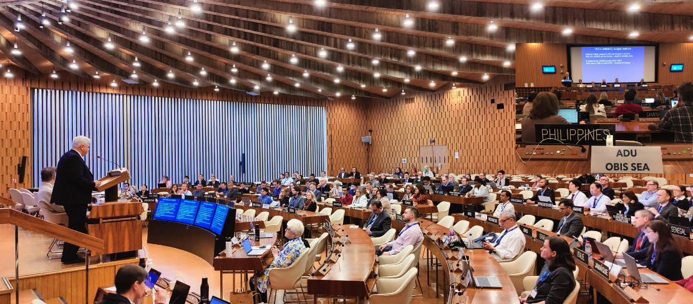

## 1: [GBIF & Science](https://docs.google.com/presentation/d/1JpGe0ZPnt8i2Mdw7un1MgdO8_JhSl6WOQwAClvK5KYE/edit?usp=sharing)

> ## Exercise 1: Governing Board and Standing Committee
> 
> 1. Which country did host the two last Governing Bards?
> 2. Who is the Chair of the Science Committee?
> 
> > ## Solution
> > 1. Australia in 2023 & Belgium in 2022
> > 2. Birgit Gemeinholzer is Science Committee Chair
> {: .solution}
{: .challenge}
> 

## 2: [GBIF & CBD](https://docs.google.com/presentation/d/1aoCRFsrTxIEztXYll_jqpyHY_wcysyTKAwDaa4XcrCI/edit?usp=sharing)

## 3: [GBIF & IPBES](https://docs.google.com/presentation/d/1aoCRFsrTxIEztXYll_jqpyHY_wcysyTKAwDaa4XcrCI/edit?usp=sharing)

## 4: [GBIF supporting SPI](https://docs.google.com/presentation/d/1LJPFOVeUz8H1EEZaYfE4sqwpIDHQIx7V_-HYH6hubLk/edit?usp=sharing)

  
