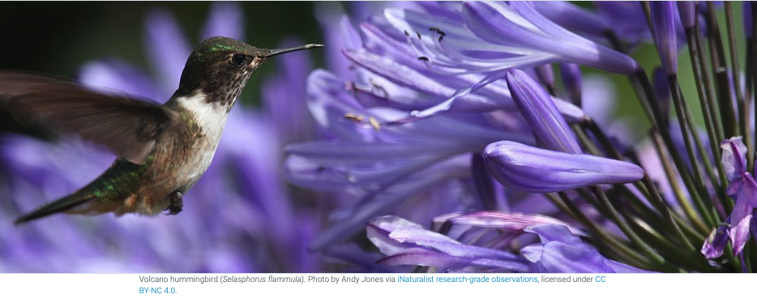

## 1: [GBIF & Science](https://docs.google.com/presentation/d/1JpGe0ZPnt8i2Mdw7un1MgdO8_JhSl6WOQwAClvK5KYE/edit?usp=sharing)

> ## Exercise 1 : GBIF and Science
> 
> 1. How many citations for the **Meditera3** dataset published by the University of Zagreb Faculty of Science?
> 2. This dataset have been reused in one thesis. Which one?
> 3. Which of the Science Review is in your field of research?
>
> > ## Solution
> > 1. 11 citations
> > 2. [Decreases over time in shannon diversity of land snails by Hmming J.](https://hdl.handle.net/2077/74972)
> > 3. Topics covered are : AGRICULTURE, BIODIVERSITY SCIENCE , BIOGEOGRAPHY , CITIZEN SCIENCE , CLIMATE CHANGE , CONSERVATION, DATA MANAGEMENT, DNA , ECOLOGY, ECOSYSTEM SERVICES,  EVOLUTION, FRESHWATER, HUMAN HEALTH, MARINE, PHYLOGENETICS, SPECIES DISTRIBUTION, TAXONOMY & INVASIVES.
> > {: .solution}
{: .challenge}

## 2: [GBIF & CBD](https://docs.google.com/presentation/d/1aoCRFsrTxIEztXYll_jqpyHY_wcysyTKAwDaa4XcrCI/edit?usp=sharing)

> ## Exercise 2 : GBIF and CBD
> 
> 1. How many citations for the **Meditera3** dataset published by the University of Zagreb Faculty of Science?
> 2. This dataset have been reused in one thesis. Which one?
> 3. Which of the Science Review is in your field of research?
>
> > ## Solution
> > 1. 11 citations
> > 2. [Decreases over time in shannon diversity of land snails by Hmming J.](https://hdl.handle.net/2077/74972)
> > 3. Topics covered are : AGRICULTURE, BIODIVERSITY SCIENCE , BIOGEOGRAPHY , CITIZEN SCIENCE , CLIMATE CHANGE , CONSERVATION, DATA MANAGEMENT, DNA , ECOLOGY, ECOSYSTEM SERVICES,  EVOLUTION, FRESHWATER, HUMAN HEALTH, MARINE, PHYLOGENETICS, SPECIES DISTRIBUTION, TAXONOMY & INVASIVES.
> > {: .solution}
{: .challenge}

## 3: [GBIF & IPBES]https://docs.google.com/presentation/d/1aoCRFsrTxIEztXYll_jqpyHY_wcysyTKAwDaa4XcrCI/edit?usp=sharing)

> ## Exercise 3 : GBIF and IPBES
> 
> 1. How many citations for the **Meditera3** dataset published by the University of Zagreb Faculty of Science?
> 2. This dataset have been reused in one thesis. Which one?
> 3. Which of the Science Review is in your field of research?
>
> > ## Solution
> > 1. 11 citations
> > 2. [Decreases over time in shannon diversity of land snails by Hmming J.](https://hdl.handle.net/2077/74972)
> > 3. Topics covered are : AGRICULTURE, BIODIVERSITY SCIENCE , BIOGEOGRAPHY , CITIZEN SCIENCE , CLIMATE CHANGE , CONSERVATION, DATA MANAGEMENT, DNA , ECOLOGY, ECOSYSTEM SERVICES,  EVOLUTION, FRESHWATER, HUMAN HEALTH, MARINE, PHYLOGENETICS, SPECIES DISTRIBUTION, TAXONOMY & INVASIVES.
> > {: .solution}
{: .challenge}

## 4: [GBIF supporting SPI](https://docs.google.com/presentation/d/1LJPFOVeUz8H1EEZaYfE4sqwpIDHQIx7V_-HYH6hubLk/edit?usp=sharing)

> ## Exercise 4 : Supporting SPI
> 
> 1. How many citations for the **Meditera3** dataset published by the University of Zagreb Faculty of Science?
> 2. This dataset have been reused in one thesis. Which one?
> 3. Which of the Science Review is in your field of research?
>
> > ## Solution
> > 1. 11 citations
> > 2. [Decreases over time in shannon diversity of land snails by Hmming J.](https://hdl.handle.net/2077/74972)
> > 3. Topics covered are : AGRICULTURE, BIODIVERSITY SCIENCE , BIOGEOGRAPHY , CITIZEN SCIENCE , CLIMATE CHANGE , CONSERVATION, DATA MANAGEMENT, DNA , ECOLOGY, ECOSYSTEM SERVICES,  EVOLUTION, FRESHWATER, HUMAN HEALTH, MARINE, PHYLOGENETICS, SPECIES DISTRIBUTION, TAXONOMY & INVASIVES.
> > {: .solution}
{: .challenge}

  
