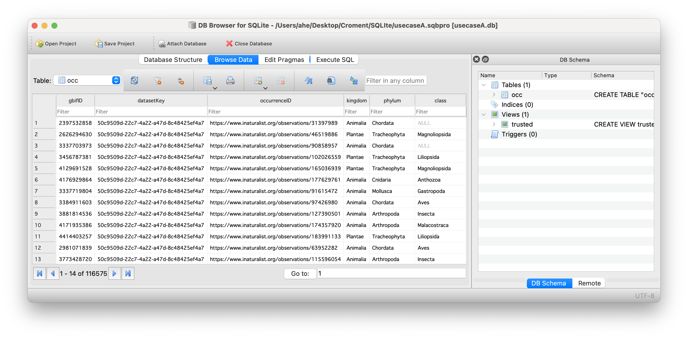

## Presentation: [SQLite](https://docs.google.com/presentation/d/1oMPNqm4tU9BwnUo1zJxI0nlXMPfIljYeAqh4vEdJZ_0/edit?usp=sharing)

---
## Exercise 1 : Download from GBIF.org
### Instructions
- Select at least one of the use cases
- Follow the use case dataset links:
    - A. [iNaturalist Research-grade Observations](https://www.gbif.org/dataset/50c9509d-22c7-4a22-a47d-8c48425ef4a7)
    - B.[Italian official Adriatic  landings between 1953 and 2012](https://www.gbif.org/dataset/6e0f65ad-8ffb-4a07-ac53-2efe9153e994)
    - C.[Naturgucker](https://www.gbif.org/dataset/6ac3f774-d9fb-4796-b3e9-92bf6c81c084)
    - D.[Trawl survey data from the Jabuka Pit area](https://www.gbif.org/dataset/29719761-2d0e-4fef-bfcb-764b20c07d40)
- Click on the **occurrences** button
- On the left panel, filter by **CountryOrArea**
- How many occurrences to you see for **Croatia**?
- ⬇️ Download in **simple CSV** format
- Open the downloaded file with a text editor

## Exercise 2 : Import data
### Instructions
- Open the DBrowser application
- Create a new empty database
- Import the GBIF downloaded data into an SQL table named ‘occ’
- How many records do you have?
- Save your database

## Exercise 3 : Explore data
### Instructions
- (Re)Open your database with DBBrowser
- Do you ALWAYS have **scientificName, date and coordinates**?
- How complete are the data? (describe)
- Put special attention to **individualCount, taxonRank, coordinatesUncertainty, license, issues** fields
- Are all records suitable for your study(**fitness for use**)? Explain why?
- Would you **filter out** some data? Explain why?

## Exercice 4 : Discard data
### Instructions
- Do you have absence data? (see **occurrenceStatus** field)
- Discard absence data
- Create a **trusted** view to eliminate **absence data** and data with **taxonRank different from SPECIES**
- How many records do you have in this trusted view?

## Exercice 5 : Filter data
### Instructions
- Do you have data without **coordinatesUncertaintyInMeters**?
- Do you have data with coordinates uncertainty > 10 km?
- Update your **trusted** view to filter out these **records**
- Select only these **fields** in your view:
    - scientificName, Date, coordinates, uncertainty and occurrenceID
- How many records do you have now?

## Exercice 6 : Annotate data
### Instructions
- IndividualCound is not a mandatory field, set it to 1 when null
- Add a **withMedia** field,  set it to True when mediaType is not null
- Add these two fields to your **trusted** view
- Export the **trusted** view results in a CSV file
- (Now you are ready to merge this online data with your own data)

---
> ## Solutions
> If needed, see the [solutions page](../18-sqlite/index.html).
> 
{: .solution}
