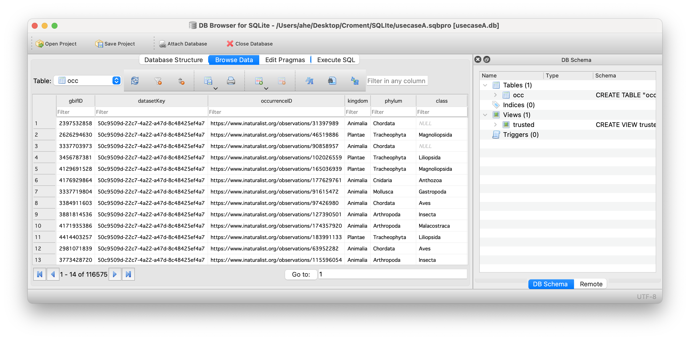

## 1: [SQLite](https://docs.google.com/presentation/d/1oMPNqm4tU9BwnUo1zJxI0nlXMPfIljYeAqh4vEdJZ_0/edit?usp=sharing)



---
## Exercise 1 : Download from GBIF.org
 
- Follow the use case dataset link, then click on **occurrences**
- See how many records per CountryOrArea?
- Filter occurrences with CountryOrArea= Croatia
- ⬇️ Download in **simple CSV format**

### Solution 1
The use cases download should look like this:
- A. [GBIF Download](https://doi.org/10.15468/dl.t2hj6v) (116,575 occurrences)
- B. [GBIF Download](https://doi.org/10.15468/dl.6gfwt3) (15,077 occurrences)
- C. [GBIF Download](https://doi.org/10.15468/dl.qy93m6) (13,668 occurrences)
- D. [GBIF Download](https://doi.org/10.15468/dl.6mf27m) (9,723 occurrences)

---
## Exercise 2 : Import into SQLite

Within DBrowser application
- Create a new empty database    
- Import the GBIF downloaded CSV as table named ‘occ’
- How many records do you have?
- Save your database

### Solution 2
```sql
select count(*) from occ; 
```

---
## Exercise 3 : Explore with DBBrowser
- Do you ALWAYS have **date, coordinates and scientificName**?
- How complete are the data? Describe their data completeness
- Put your attention to **individualCount, taxonRank, coordinatesUncertainty, license,...**
- Will you take all records for your study(fitness for use)? Explain why? 
- Will you filter out some data? Explain why? 

### Solution 3
```sql
select * from occ where scientificName is null;
select * from occ where year is null or month is null or day is null;
select * from occ where decimalLatitude is null or decimalLongitude is null;

select count(*) from occ where individualCount is null;

select taxonRank, count(*) from occ group by taxonRank;
select phylum, count(*) from occ group by phylum;
select license, count(*) from occ group by license;
```

## Exercice 4 : Discard some data
- Do you have absence data? (see **occurrenceStatus**)
- Discard absence data
- Create a **trusted** view that eliminates absence data and taxonRank different from SPECIES
- How many records do you now?

### Solution 4
```sql
select count(*) from occ where occurrenceStatus='ABSENT';

create view trusted as select * from occ where occurrenceStatus='PRESENT' and taxonRank='SPECIES';
select count(*) from trusted;
```

---
## Exercice 5 : Filter data

- Do you have data without coordinatesUncertaintyInMeters?
- Do you have data with coordinates uncertainty > 10.000 m?
- Update your **trusted**  view to :
	- filter out these **records**
	- select only these **fields** :Date, coordinates, uncertainty, occurrenceID and scientificName

### Solution 5
```sql
select count(*) from occ where coordinateUncertaintyInMeters is null;
select coordinateUncertaintyInMeters, count(*) from occ group by coordinateUncertaintyInMeters;
select * from occ where CAST(coordinateUncertaintyInMeters as INTEGER) > 10000;

drop view if exists trusted ;
create view trusted as select year,month,day,decimalLatitude, decimalLongitude,  CAST(coordinateUncertaintyInMeters as INTEGER) as uncertainty, scientificName, occurrenceID from occ where occurrenceStatus='PRESENT'  and taxonRank='SPECIES' and uncertainty <= 10000;
select count(*) from trusted;
```

---
## Exercice 6 : Annotate data
- Set individualCount to 1 when value is null
- Add a new withMedia field,  set it to True when mediaType is not null
- Add these two fields  to your **trusted** view
- Export the **trusted** view results in a new CSV file

### Solution 6
```sql
update occ set individualCount=1 where individualCount is null;
drop view if exists trusted ;
create view trusted as select year,month,day,decimalLatitude, decimalLongitude,  CAST(coordinateUncertaintyInMeters as INTEGER) as uncertainty, scientificName, occurrenceID, individualCount, mediaType is not null as withMedia from occ where occurrenceStatus='PRESENT'  and taxonRank='SPECIES' and uncertainty <= 10000;
```
