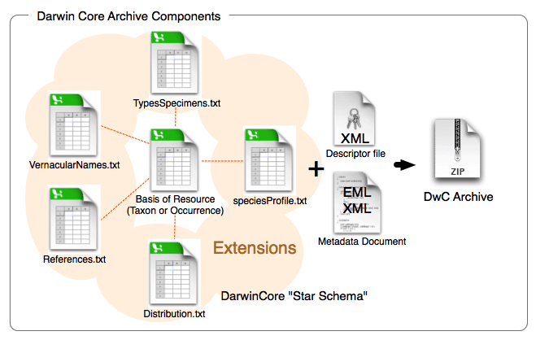

## [Darwin Core Extensions](https://docs.google.com/presentation/d/1DtQ16FmA1v4FjwIuGA6UzXHqjvSgVrjiixpIBjnYa9U/edit?usp=sharing)

Now that we have a firm basis for understanding the different terms in Darwin Core the next part to understand is how data tables are organized and the difference between cores and extensions. You will always have a core table (Occurrence core or Event core) with either no extensions or several. What you choose depends on the data you have and how to represent it best. The original Darwin Core core is the [Occurrence core](https://rs.gbif.org/core/dwc_occurrence_2022-02-02.xml). Once people started using that core they began to see that they needed extensions to that core to best represent the data they were trying to share and therefore [several extensions](https://rs.gbif.org/extensions.html) have been developed (and are continuing to be developed). As more monitoring data has been shared over time, another core type called [Event core](https://rs.gbif.org/core/dwc_event_2022-02-02.xml) was added. Without getting too far into the weeds on the cores and extensions, what's most important to understand is that you need to pick your core type and once you do that then you pick the extensions to go with it. For example, if your data took place as part of an event (cruise, transects, etc) you will pick Event core. If there was no sampling event, then you will pick Occurrence core.

### Different options for sharing the data
#### Occurrence Core only
The bare minimum for sharing data to OBIS is to use the [Occurrence Core](https://rs.gbif.org/core/dwc_occurrence_2022-02-02.xml) with no extensions. This core type covers datasets that only include observations and/or specimen records where no information on sampling is available. Occurrence core is also used for eDNA or DNA derived data. 

The Occurrence core allows you to provide all the required Darwin Core terms detailed in the [intro section]({{ page.root }}/01-introduction/index.html). You can produce a fully compliant Darwin Core version of your data using only the Occurrence core ([see this example by Tylar Murray](https://github.com/ioos/bio_data_guide/blob/main/datasets/example_obis_minimum_flair/occurrences.csv)). On the one hand, if the data were collected using some kind of sampling methodology, you will lose much of that information if you use this most simple form of the data. One the other, it is faster and easier to produce.

> ## Thought Experiment 
> Look at the [minimum required fields example](https://github.com/ioos/bio_data_guide/blob/main/datasets/example_obis_minimum_flair/occurrences.csv). What is possible
> to do in future reuse? What would not be possible? For instance, note that there is no information about depth or the uncertainty of the coordinates.
> For more examples check out the [Datasets folder](https://github.com/ioos/bio_data_guide/tree/main/datasets) in the IOOS Bio Data Guide.
{: .callout}

#### Occurrence Core + extensions
Using the Occurrence core plus [relevant extensions](https://rs.gbif.org/extensions.html) means that you can capture more of the data that's been recorded. As an example, let's consider an environmental DNA dataset. eDNA datasets have information that is unique to that method and will not be represented well using Occurrence core only. To document eDNA using Darwin Core you should follow [this guide](https://doi.org/10.35035/doc-vf1a-nr22); you will need the Occurrence core plus the [DNA derived data extension](https://rs.gbif.org/extension/gbif/1.0/dna_derived_data_2022-02-23.xml). Adding the DNA derived data extension allows you to capture information such as the PCR primer used, DNA sequences, standard operating procedure used in the assembly and other information specific to this type of data.

Let's consider another example: a museum dataset that has biological measurements for each individual specimen (e.g. length). All information about each organism's occurrence (taxonomic information, locality, identification, etc.) will go into the Occurrence core. You can then capture the biotic measurement information (type of measurement, units, accuracy, etc.) by using either the [Measurement or Facts extension](https://rs.gbif.org/extension/dwc/measurements_or_facts_2022-02-02.xml), or the [Extended Measurement or Fact extension](https://rs.gbif.org/extension/obis/extended_measurement_or_fact.xml) (we elaborate on this extension below). Note again here we do not have information on *how* the organisms were sampled. 

#### Checklist Core + extensions
Suitable for publication of Taxonomic data, still in use but [ColDP](https://github.com/CatalogueOfLife/coldp) standard is about to replace that.

#### Event Core + extensions
As we have indicated earlier, the Event core is for datasets that include known sampling events - details are known about how, when, and where samples were taken.

An innovation that OBIS made in this space was introducing the Extended Measurement or Fact extension (also sometimes referred to as OBIS-ENV-DATA, or eMoF). This uses the Event core with an Occurrence extension + the [extended Measurement or Fact extension](https://rs.gbif.org/extension/obis/extended_measurement_or_fact.xml). The eMoF extension makes it possible to include measurements for **both** the events (salinity, temperature, dissolved oxygen, gear type, etc.) as well as measurements about the occurrences (weight, length, etc.). Prior to this you were only able to include measurements of the occurrence (in the Measurement or Facts extension).

When these types of measurement data were collected, they may have each had their own column in your dataset. However, the Extended Measurement of Fact extension does not format data in this way. Rather than documenting each of your measurements in separate columns, measurements will be condensed into one column: `measurementValue` (e.g. 15). Then, to tell us what that value is, there is the column `measurementType` which describes what the measurement actually is (e.g. length). Finally the column `measurementUnit` is used to indicate the unit of the measurement (e.g. cm).

Now, you may wonder - what do you write in the "measurementType" field? For some measurements, it may be simple. For others, maybe not as simple. The good news is this field is unconstrained - you can populate it with free text as you like. But what if you were interested in getting all records that have "length" measurements from OBIS? Due to the inevitable heterogeneity in how different people would document "length", you would have to try to account for all these different ways!

The key thing about the extended Measurement or Fact extension that gets around this challenge, is that it provides a way to include Unique Resource Identifiers (URIs). These URIs are used to populate the `measurementTypeID` field (as well as `measurementUnitID` and `measurementValueID`). URIs mean that if you call the measurementType "abundance" but I call it "Abundance per square meter" and we both use the measurementTypeID "http://vocab.nerc.ac.uk/collection/P01/current/SDBIOL02/" then we know this is the same measurement type even if we didn't use the same free text words to describe it. Choosing the right URI can be difficult but you can read about finding codes [here](https://github.com/nvs-vocabs/P01). All you need to know for now is that you should try to find a `measurementTypeID` URI that belongs to the [P01 collection](http://vocab.nerc.ac.uk/search_nvs/P01/?searchstr=&options=identifier,preflabel,altlabel,status_accepted&rbaddfilter=inc&searchstr2=). OBIS is developing guidelines to help you with the process of choosing URIs, so stay tuned to their [manual](https://manual.obis.org/) for updates.

> ## Tip 
> Consider to check the [Datasets classes](https://www.gbif.org/dataset-classes) pages and the Data Quality requirements for each of them.
{: .callout}

### What's in an ID?

| Darwin Core Term | Description | Example   |
|------------------|-------------|-----------|
| [eventID](https://dwc.tdwg.org/terms/#dwc:eventID) | An identifier for the set of information associated with an Event (something that occurs at a place and time). May be a global unique identifier or an identifier specific to the data set. | `INBO:VIS:Ev:00009375` `Station_95_Date_09JAN1997:14:35:00.000`   `FFS-216:2007-09-21:A:replicateID1024`|
|[occurrenceID](https://dwc.tdwg.org/terms/#dwc:occurrenceID)|An identifier for the Occurrence (as opposed to a particular digital record of the occurrence). In the absence of a persistent global unique identifier, construct one from a combination of identifiers in the record that will most closely make the occurrenceID globally unique.|`urn:catalog:UWBM:Bird:89776`   `Station_95_Date_09JAN1997:14:35:00.000_Atractosteus_spatula`   `FFS-216:2007-09-21:A:replicateID1024:objectID1345330`|
|[measurementID](https://dwc.tdwg.org/terms/#dwc:measurementID)| An identifier for the MeasurementOrFact (information pertaining to measurements, facts, characteristics, or assertions). May be a global unique identifier or an identifier specific to the data set.| `9c752d22-b09a-11e8-96f8-529269fb1459`|

IDs are the keys in your data that are used to link tables together. For example, an occurenceID in the Extended Measurement or Fact table records information about an organism with the same occurrenceID within the Occurrence core table. IDs are also the keys that keep track of each of the records, so that if you notice a mistake or missing information you can keep the record in place in the global aggregators and fix the mistake or add the missing information. For instance, let's say you have a record with an occurrenceID `Station_95_Date_09JAN1997:14:35:00.000_Atractosteus_spatula` and after it's published to OBIS you notice that the latitude was recorded incorrectly. When you fix that record in the data you would keep the occurrenceID `Station_95_Date_09JAN1997:14:35:00.000_Atractosteus_spatula`, fix the latitude, and republish the data so that the record is still present in OBIS but you have fixed the mistake.

With that in mind what is the best way to create an eventID, occurrenceID, or measurementID? Until we have a system that mints Persistent Identififers for individual records then the best way we have seen is to build the ID from information in the data itself. That way if you need to update or fix a record you simply use the same information again to build the same ID for the same record. Take our example above `Station_95_Date_09JAN1997:14:35:00.000_Atractosteus_spatula`. This is a concatenation of information from the original source data of the Station number + Verbatim Date + Scientific name. Because this is unique for each row in the occurrence file and we have kept the original data in its original format we can always rebuild this ID by concatenating this same information together again.

It is very important that these IDs do not change over time. So if an ID for a museum specimen is built from e.g. the institution the specimen is being held at, but then the specimen changes institutions - its ID should **not** change to reflect the move. If the ID changes then the record will be duplicated in the global database and record information could be lost over time.

## Exercise Time!
Now, let's try a practical use case where a birds watchers group send you their data.
see [explanations](https://docs.google.com/document/d/1XBrbPHQFNHnJfbJJ6VFn4OkKKP80OtDg-dzODgsSaiw/edit?usp=sharing)

> ## 1. Initial checks
> 1. yes
> 2. yes
> 3. not everything cristal clear
> 4. Metadata is not complete
> 5. Event Core
> 6. Occurrence and MeasurementOrFact
> 7. Yes
> 8. Maybe geodeticDatum, coordinatesUncertainty... 
> 9. Yes into event, occurrence and measurement
> 10. Occurrence identifiers are missing
> 
{: .solution}

> ## 2. Data cleaning
> - ScientificNames shall appear on each row
> - Colors, if meaningful, shall be added as column
> - Missing data should be **null**
> - OccurrenceIDs are missing, we suggest to use spreadsheet rowID
> - Incorrect eventIDs shall be removed or corrected 
>  
{: .solution}

> ## 3. DarwinCore mapping
> - Original data shall be organized in event, occurrence and measurements
> - Metadata should be more elaborated : Taxonomic, geographic, time scope...
> - License/waiver should be selected
> - Fields name should correspond to DarwinCore terms
> 
{: .solution}
