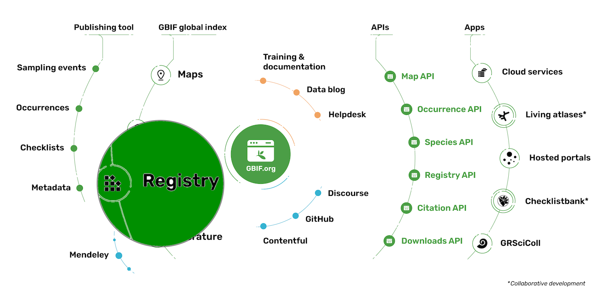

## [Presentation](https://docs.google.com/presentation/d/1CmC5LUlm9TIS1LLG-yP0dOMCAR8qgK957BuEnu9Jl7Q/edit?usp=sharing)

This presentation will introduce you to GBIF Registry( a core component of GBIF architecture ). 

---
## Exercise 1 : Find your organisation in the Registry
Within your browser: 
- List the publishing organizations from Croatia
- Get all details of your organization, (or another one if you are not in the list)
- Gets a list of datasets published by this organization

### Solution 1
- [Croatian organisations](https://api.gbif.org/v1/organization?q=Croatia)
- [organisation details](https://api.gbif.org/v1/organization/5e97290d-b5d3-470b-a3ac-aac0c3e078b2)
- [organisation datasets](https://api.gbif.org/v1/dataset/search?publishingOrg=5e97290d-b5d3-470b-a3ac-aac0c3e078b2)

---
## Exercise 2 : use Python or R programming
With Pygbif or Rgbif packages: 
- List the publishing organizations from Croatia
- Get all details of your organization, (or another one if you are not in the list)
- Gets a list of datasets published by this organization

### Solution 2
