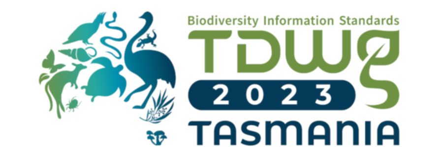

## TDWG
Biodiversity Information Standards (TDWG) is a non-profit organization and a community dedicated to developing biodiversity information standards.
To achieve its goals, TDWG:
- Develops, ratifies and promotes standards and guidelines for the recording and exchange of data about organisms
- Acts as a forum for discussing all aspects of biodiversity information management through meetings, online discussions, and publications

see [TDWG website](https://www.tdwg.org/about/) for more.

### Community
TDWG is an open, bottom-up organization. Anyone can become a member, individuals as well as institutions (including government agencies, non-governmental organizations, programs, and projects). Everything TDWG produces comes from the expertise, collaboration, and support of its members - people and organizations who create, manage, integrate, and analyze biodiversity information.

As an example, let's see the [**How we developed a Data Exchange Format: Lessons Learned from Camera Trap Data Package (Camtrap DP)**. 
](https://www.youtube.com/watch?v=M0D-Bgsqujg&list=PLD9-DRLWVl0nmd29wg2Qw160gRBaDD4Ki&index=29)
Presented by Peter Desmet as part of the TDWG 2023 Hybrid Annual Conference in Hobart, Tasmania.

### Standards
[Darwin Core](https://dwc.tdwg.org/) is a standard maintained by the Darwin Core Maintenance Interest Group. 

[What is Darwin Core, and why does it matter?](https://www.gbif.org/darwin-core)
>The Darwin Core Standard (DwC) offers a stable, straightforward and flexible framework for compiling biodiversity data from varied and variable sources.

### Conferences
TDWG annual conferences provide a showcase for state of the art biodiversity informatics, much of which relies on the standards created by TDWG and other organizations. Our conferences also provide a forum for developing, refining, and extending our standards in response to new challenges and opportunities.
