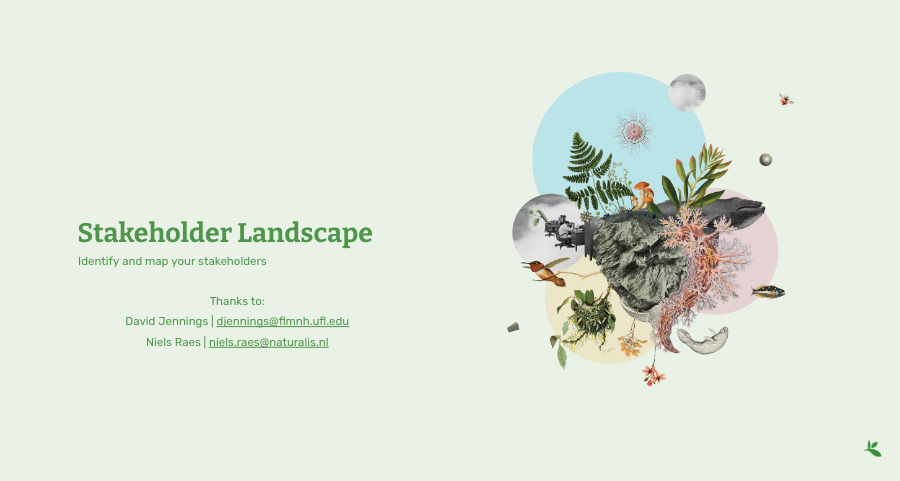

## [Presentation](https://docs.google.com/presentation/d/1ad2hfTNhz2aR4YwYp9AUoJtsff_2rZ4F7j4c3E_i4xU/edit?usp=sharing)

## Exercise
1. List all your stakeholders
2. Map them with this [matrix](https://docs.google.com/document/d/1N8jP9_v5VOwqQE9dkMGd_7n65ePX_cpo/edit?usp=sharing&ouid=118017812408214394105&rtpof=true&sd=true)
4. Determine your **key stakeholders** = Influent AND Interested
5. Determine your **audience** = Influent OR Interested
